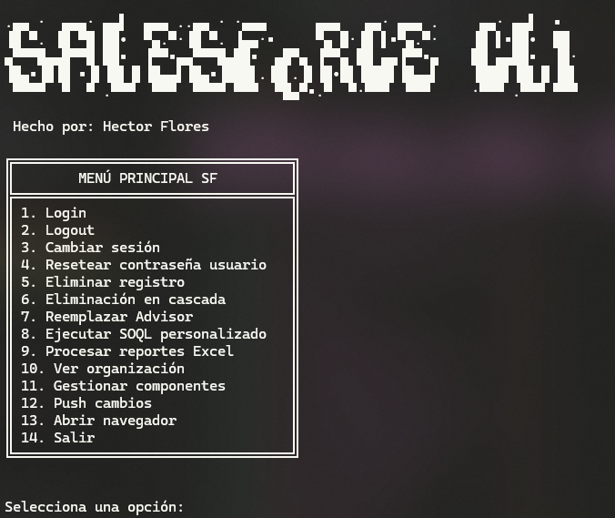
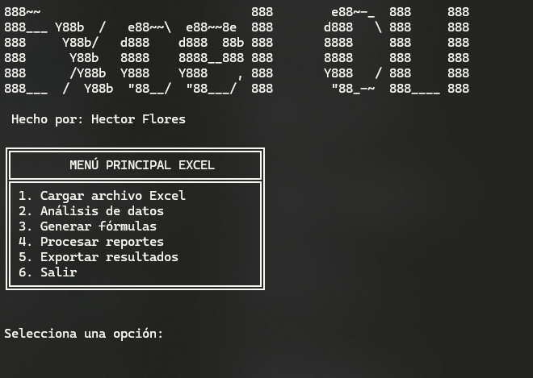

# Menu-CLI


Colección de herramientas CLI (Command Line Interface) desarrolladas en Python para facilitar tareas administrativas y de desarrollo.

## Herramientas Disponibles

### Salesforce CLI
Una interfaz de línea de comandos para Salesforce que permite:

- Gestión de múltiples sesiones (producción y sandbox)
- Login/Logout automático
- Visualización de información de la organización
- Gestión de componentes
- Push de cambios
- Ejecución de consultas SOQL
- Y más...



### Excel CLI
Una herramienta de análisis y manipulación de datos en Excel que ofrece:

- Análisis de datos (duplicados, valores únicos, estadísticas)
- Generador de fórmulas avanzadas
- Procesamiento de reportes acumulativos
- Exportación a múltiples formatos (Excel, CSV, SQL)
- Integración con bases de datos
- Automatización de tareas
- Y más...



## Requisitos

```bash
pip install -r requirements.txt
```

## Uso

Para Salesforce CLI:
```bash
python sf-cli.py
```

Para Excel CLI:
```bash
python excel-cli.py
```

## Características

### Salesforce CLI
- Interfaz intuitiva con menús interactivos
- Gestión de sesiones persistente
- Soporte para múltiples instancias
- Exportación automática de consultas
- Integración con navegador web

### Excel CLI
- Análisis avanzado de datos
- Generación automática de fórmulas
- Procesamiento de reportes
- Exportación multi-formato
- Integración con bases de datos
- Automatización de tareas
- Visualización de datos

## Documentación

- [Notas de Desarrollo Excel CLI](excel-cli.txt)
- [Documentación Salesforce CLI](sf-cli.txt)

## Autor

Hector Flores